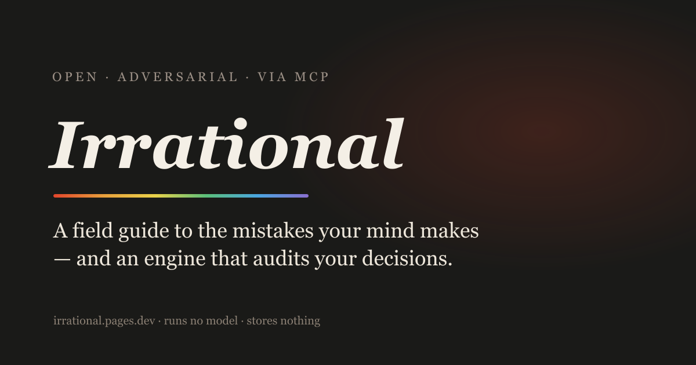

# Irrational

**A field guide to the mistakes your mind makes, and an open, adversarial behavioural-bias engine you can call from your own AI or any MCP agent.**

<p align="center">
  <a href="https://irrational.pages.dev"></a>
</p>

[](https://irrational.pages.dev)
[](https://registry.modelcontextprotocol.io/v0/servers?search=irrational)
[](https://github.com/urbanmorph/irrational/actions/workflows/ci.yml)
[](LICENSE)
[](CONTRIBUTING.md)

→ **[irrational.pages.dev](https://irrational.pages.dev)** · [Field guide](https://irrational.pages.dev/biases) · [Connect via MCP](https://irrational.pages.dev/mcp) · [Sources](https://irrational.pages.dev/sources)

Irrational **runs no AI model.** It provides the curated adversarial framework, a 22-bias catalogue, and a stateless scaffold, delivered as a public field guide and an open MCP tool, and the reasoning is done by whatever model you or your agent already have. **No API keys. No stored decisions. Nothing leaves you.**

A frontier model already knows the biases, so the value isn't informational; it's behavioural. A plain LLM is trained to agree, while Irrational has a fixed adversarial contract (_assume you're biased, refuse to validate, argue the other side_) that an agent can invoke systematically, even on its own draft reasoning.

## What an audit looks like

> **You:** "We should rewrite our 6-year-old backend from scratch this year, we've already spent two months on a POC that went well, and I'm confident we can finish in six."

> **THE CALL**: Don't greenlight the big-bang rewrite. Carve off the worst module first, with a hard 3-month checkpoint. Confidence the 6-month plan succeeds: ~25%, mostly **sunk cost** + the **planning fallacy**.
>
> **THE AUDIT**: Those "two months on a POC" are gone either way, but they're doing most of the talking _(sunk cost)_. "About six months" is a best-case with no reference class; rewrites of mature systems routinely run 2–3× _(planning fallacy)_…

Verdict-first, every bias tied to your own words, grounded in a cited catalogue. [See the full worked examples →](https://irrational.pages.dev/#engine)

## Add it to your AI

Listed on the **[official MCP Registry](https://registry.modelcontextprotocol.io/v0/servers?search=irrational)** as `io.github.urbanmorph/irrational`. Connect any MCP client to the live endpoint, no install, no keys:

```bash
# Claude Code
claude mcp add --transport http irrational https://irrational.pages.dev/mcp/server
```

…or point any MCP client at `https://irrational.pages.dev/mcp/server`:

```json
{
  "mcpServers": {
    "irrational": {
      "type": "http",
      "url": "https://irrational.pages.dev/mcp/server"
    }
  }
}
```

Tools: `analyze_decision` (the adversarial audit) · `list_biases` · `get_bias`. Pass `language` for a reply in another language, or `structured: true` for parseable JSON.

## What's inside

- **Field guide**: 22 cognitive biases grouped by Buster Benson's four problems the brain solves, each with the question that breaks its spell and a **verified citation**.
- **The engine**: an MCP server exposing `analyze_decision`, `list_biases`, `get_bias`. `analyze_decision` returns a verdict-first _directive_ your model executes. The discipline is ours; the reasoning is yours.
- **The web forge**: type a decision; it assembles the adversarial prompt in your browser and hands off to _your_ AI. No model runs here.
- **Pen-and-paper audit**: the whole method on one [printable page](https://irrational.pages.dev/checklist).

## Stack

Astro (pure static) · Cloudflare Pages · a hand-rolled, dependency-free JSON-RPC MCP endpoint as a [Pages Function](functions/mcp/server.ts). No runtime model, no database. Single source of truth: [`src/data/biases.ts`](src/data/biases.ts) feeds both the web and the MCP.

## Develop

```bash
npm install --ignore-scripts   # we don't use image optimization, so skip sharp's native build
npm run dev                    # http://localhost:4321
npm test                       # vitest, engine + catalogue (29 tests)
npm run build                  # static pages
```

The MCP endpoint is a Cloudflare Pages Function, run it locally with `npx wrangler pages dev dist`.

## Contributing

Translations, proposed biases, and worked examples are welcome, see [CONTRIBUTING.md](CONTRIBUTING.md). This project also publishes a public [PDGI scorecard](PDGI.md).

## Licence

Code is **[MIT](LICENSE)**. The bias-catalogue text (definitions, examples, and the curated prose in `src/data/`) is additionally available under **CC-BY-4.0**. Every claim is cited, see [/sources](https://irrational.pages.dev/sources).

Built by [Urban Morph](https://urbanmorph.com).
